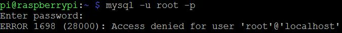
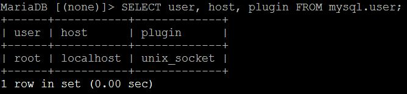
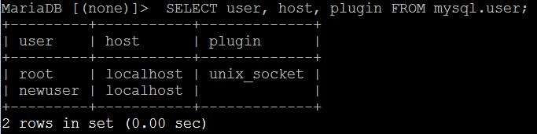
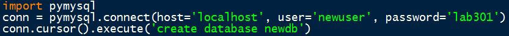
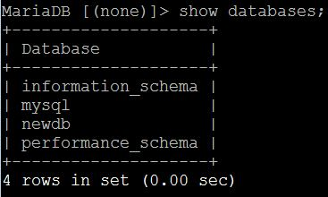

# Automation_mysql
20180518

## Install mysql server on raspberry pi
> $sudo apt-get -y install mysql-server

### Problem statement for new version
If we try to log into the mysql database server via command line, it throws an error illustrated in below image: \

This is because the current Debian (v9 Stretch) installation uses mariaDB as its database engine. \
Now let's use super user to log into mysql to change some settings. 
> $sudo mysql

======Welcome to the MariaDB monitor====== \
Take a look at the default user settings: 
> MariaDB[(none)]> SELECT user, host, plugin FROM mysql.user;

Here we can see that the plugin of user 'root' is set to 'unix socket'. \
Which means that mariaDB by default uses UNIX_SOCKET rather than AUTH_SOCKET to authenticate user root, hence we cannot access through user root (via command line). \
How do we fix this? 

### Create new user
The solution is to create a new user besides root, in order to enable external access from python, node.js, etc. 
> MariaDB[(none)]> CREATE USER 'newuser'@'localhost' IDENTIFIED BY 'lab301'; \
> MariaDB[(none)]> GRANT ALL PRIVILEGES ON *.* TO 'newuser'@'localhost'; \
> MariaDB[(none)]> flush privileges;

Now run following to show the user settings again: 
> MariaDB[(none)]> SELECT user, host, plugin FROM mysql.user;

And here is our new user. 

### Test settings
> MariaDB[(none)]> quit

======back to raspberry pi console====== 
> $mysql -u newuser -p \
> (enter password)

You should be able to login via command line by now. 

## Pymysql
A software connector between python and mysql database will be introduced here. 
> $pip3 install pymysql

Clone example repo: 
> $cd ~/Desktop \
> $git clone https://github.com/wildcat5566/Automation_mysql.git \
> $cd ~/Automation_mysql \
> $nano pymysqltest.py

Take a look at example code: 

First line imports module. \
Second line creates connection object 'conn' towards server held at localhost, logging in as user and password we've just set. \
Third line executes SQL command which is to create a new database named 'newdb'.

> $python3 pymysqltest.py

This example creates a database under the mysql server. \
Now check again: 
> $mysql -u newuser -p \
> (password)

======Welcome to the MariaDB monitor====== \
Take a look at the database list: 
> MariaDB[(none)]> show databases;

